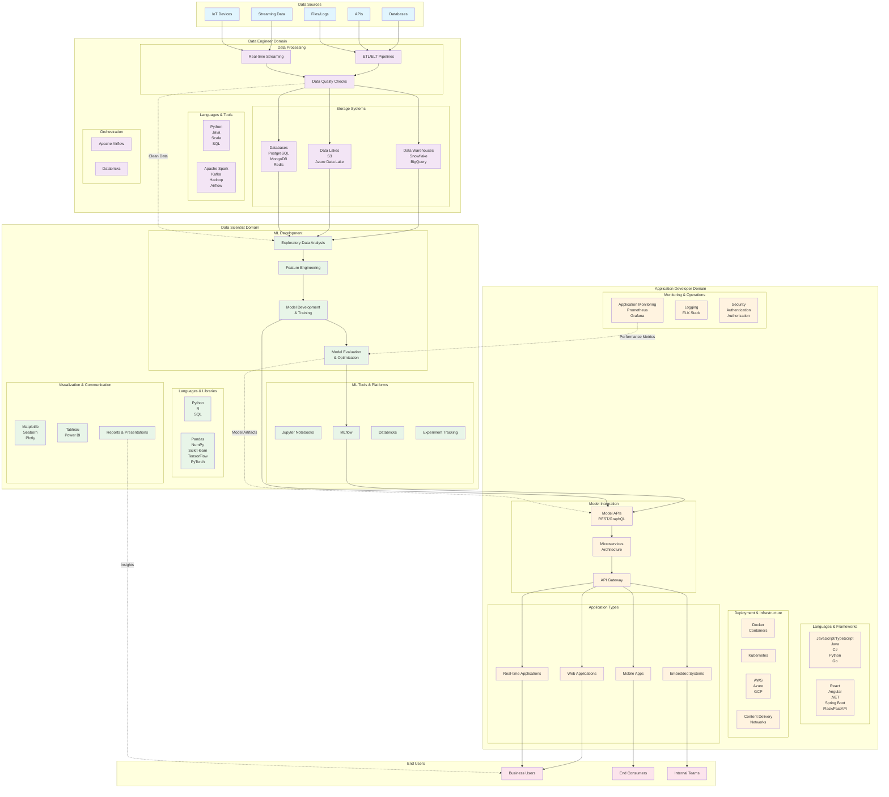

# AI/ML Ecosystem: Data Scientists, Data Engineers, and Application Developers

This diagram illustrates how Data Scientists, Data Engineers, and Application Developers collaborate in an AI/ML ecosystem, showing their tools, technologies, databases, and environments.

## Ecosystem Overview

## Detailed Technology Stack by Role

### Data Engineers
- **Primary Focus**: Data Infrastructure & Pipeline Management
- **Languages**: Python, Java, Scala, SQL
- **Key Technologies**: 
  - **Stream Processing**: Apache Kafka, Apache Storm
  - **Batch Processing**: Apache Spark, Hadoop MapReduce
  - **Orchestration**: Apache Airflow, Prefect
  - **Storage**: Snowflake, BigQuery, PostgreSQL, MongoDB, Redis
  - **Cloud Platforms**: AWS (EMR, Glue), Azure (Synapse), GCP (Dataflow)

### Data Scientists
- **Primary Focus**: Model Development & Insights Generation
- **Languages**: Python, R, SQL
- **Key Libraries**: 
  - **Data Manipulation**: Pandas, NumPy, Dplyr (R)
  - **ML Frameworks**: Scikit-learn, TensorFlow, PyTorch, XGBoost
  - **Visualization**: Matplotlib, Seaborn, Plotly, ggplot2 (R)
  - **Experiment Tracking**: MLflow, Weights & Biases, Neptune

### Application Developers
- **Primary Focus**: Model Deployment & User-Facing Applications
- **Languages**: JavaScript/TypeScript, Java, C#, Python, Go
- **Key Frameworks**: 
  - **Frontend**: React, Angular, Vue.js
  - **Backend**: Spring Boot, .NET Core, Flask, FastAPI, Express.js
  - **Mobile**: React Native, Flutter, Swift, Kotlin
  - **Deployment**: Docker, Kubernetes, Terraform

## Key Interaction Points

1. **Data Engineers → Data Scientists**: Clean, structured datasets through data pipelines
2. **Data Scientists → Application Developers**: Trained models and model artifacts
3. **Application Developers → End Users**: AI-powered applications and services
4. **Feedback Loop**: Performance metrics and user feedback flow back to improve models and data quality

## Shared Technologies & Collaboration Tools

- **Cloud Platforms**: AWS, Azure, GCP (used by all roles)
- **Containerization**: Docker (used across the pipeline)
- **Version Control**: Git, GitHub/GitLab (universal)
- **Communication**: Slack, Microsoft Teams, Jira
- **Documentation**: Confluence, Notion, Wiki systems
- **Data Platforms**: Databricks (shared by Data Engineers and Data Scientists)

This ecosystem demonstrates how each role contributes specialized expertise while working collaboratively to deliver AI-powered solutions to end users.
