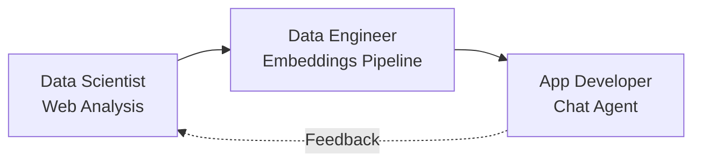

# LangGraph Tutorial: 3-Exercise Team Workshop

**Duration:** 2-3 hours total (45-60 minutes per exercise)  
**Target:** Intermediate developers learning AI/ML collaboration patterns

This tutorial demonstrates how Data Scientists, Data Engineers, and Application Developers collaborate using LangGraph and AWS Bedrock. Each exercise builds on the previous one, creating a complete AI-powered workflow.

## 🎯 Learning Objectives

- **Data Scientists**: Learn to use JavaScript for web data exploration and analysis
- **Data Engineers**: Build embeddings pipelines and populate vector databases  
- **Application Developers**: Create chat agents that leverage stored embeddings

## 📋 Prerequisites

- Basic JavaScript/Node.js knowledge
- AWS Account with Bedrock access (Claude/Titan models)
- Git and Node.js installed

## 🚀 Quick Setup

```bash
# Clone and setup
cd langgraph-tutorial
npm install

# Configure AWS credentials
aws configure
# or export AWS_ACCESS_KEY_ID and AWS_SECRET_ACCESS_KEY
```

## 📚 Exercises Overview

### Exercise 1: Data Science - Web Data Exploration (45 min)
**Role:** Data Scientist  
**Focus:** Data discovery and analysis using JavaScript tools

- Fetch and analyze web content using LangGraph
- Use JavaScript data manipulation (similar to pandas/numpy)
- Generate insights and prepare data for engineering pipeline

**Key Skills:** Data exploration, statistical analysis, visualization prep

### Exercise 2: Data Engineering - Embeddings Pipeline (60 min)
**Role:** Data Engineer  
**Focus:** Transform analyzed data into searchable embeddings

- Build LangGraph workflows for data processing
- Generate embeddings using AWS Bedrock
- Store vectors in ChromaDB with metadata
- Implement data quality checks and monitoring

**Key Skills:** ETL pipelines, vector databases, data validation

### Exercise 3: App Development - RAG Chat Agent (45 min)
**Role:** Application Developer  
**Focus:** Build user-facing chat interface

- Create LangGraph agent with conversation memory
- Implement semantic search using stored embeddings
- Build interactive chat interface
- Deploy and test the complete system

**Key Skills:** API integration, user experience, system integration

## 🔄 Collaboration Flow



## 📁 Project Structure

```
langgraph-tutorial/
├── README.md                          # This file
├── package.json                       # Shared dependencies
├── exercise-1-data-science/
│   ├── starter-code.js                # Scaffolded web scraper
│   ├── data-analysis-tools.js         # JS utilities (pandas-like)
│   └── README.md                      # Exercise instructions
├── exercise-2-data-engineering/
│   ├── embeddings-pipeline.js         # LangGraph ETL workflow
│   ├── vector-store.js                # ChromaDB integration
│   └── README.md                      # Exercise instructions
└── exercise-3-app-development/
    ├── chat-agent.js                  # LangGraph chat agent
    ├── server.js                      # Express.js API
    └── README.md                      # Exercise instructions
```

## ⏱️ Time Management Tips

- **Don't get stuck on setup** - Use provided scaffolding
- **Focus on core concepts** - Skip deep customization  
- **Pair programming encouraged** - Different roles can help each other
- **Use TODO comments** - Complete marked sections only

## 🎯 Success Criteria

By the end of this tutorial, you'll have:

1. ✅ **Working data analysis pipeline** (Exercise 1)
2. ✅ **Populated vector database** (Exercise 2) 
3. ✅ **Functional chat agent** (Exercise 3)
4. ✅ **Understanding of role boundaries** and collaboration points

## 🚦 Getting Started

1. **Read this README completely**
2. **Run the setup commands**
3. **Start with Exercise 1** (regardless of your primary role)
4. **Complete exercises in order** - they build on each other

---

**Ready to start?** Head to `exercise-1-data-science/README.md`
