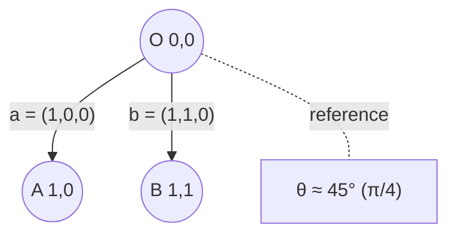

# Angle Between Two 3D Vectors (Example)

This example shows how to compute the angle between two simple 3D vectors and gives a JavaScript helper plus a Mermaid diagram illustrating the vectors and the angle.

## Vectors

Let:
- a = (1, 0, 0)
- b = (1, 1, 0)

Both lie in the XY plane (z = 0), so we can visualize them in 2D.

## Formula

Angle θ between vectors a and b in any dimension:

θ = arccos( (a · b) / (||a|| * ||b||) )

Calculations:
- Dot product: a·b = 1*1 + 0*1 + 0*0 = 1
- Norms: ||a|| = 1,  ||b|| = sqrt(1 + 1) = √2
- Cosine similarity: cosθ = 1 / √2 ≈ 0.70710678
- Angle: θ = arccos(1/√2) = π/4 ≈ 0.785398 rad ≈ 45°

## JavaScript Utility

```js
function angleBetween(a, b) {
  if (a.length !== b.length) throw new Error("Dimension mismatch");
  let dot = 0, na = 0, nb = 0;
  for (let i = 0; i < a.length; i++) {
    const x = a[i], y = b[i];
    dot += x * y;
    na += x * x;
    nb += y * y;
  }
  if (na === 0 || nb === 0) throw new Error("Zero vector");
  const cos = Math.min(1, Math.max(-1, dot / (Math.sqrt(na) * Math.sqrt(nb))));
  return { cosine: cos, radians: Math.acos(cos), degrees: Math.acos(cos) * 180 / Math.PI };
}

console.log(angleBetween([1,0,0], [1,1,0])); // { cosine: ~0.7071, radians: ~0.7854, degrees: 45 }
```

## Mermaid Diagram

Mermaid doesn’t natively render geometric angles, but we can label the vectors and the computed angle. Here the origin is O, endpoints are A and B.



## Second Example (Orthogonal)

Let c = (0, 2, 0) and d = (3, 0, 5):
- c·d = 0 → cosθ = 0 → θ = 90°

(They’re not both confined to the same 2D plane for simple plotting, so only the first example is diagrammed.)

## Notes
- Works identically for high-dimensional embeddings (e.g., 1536-D); only the loop length changes.
- Often you only need cosine similarity; angle is `Math.acos(cosine)` if required.
- Clamp the cosine to [-1, 1] before `acos` to avoid floating-point NaN.
